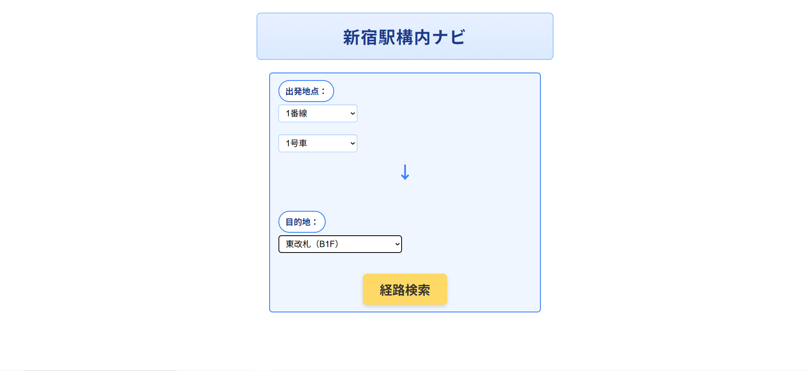
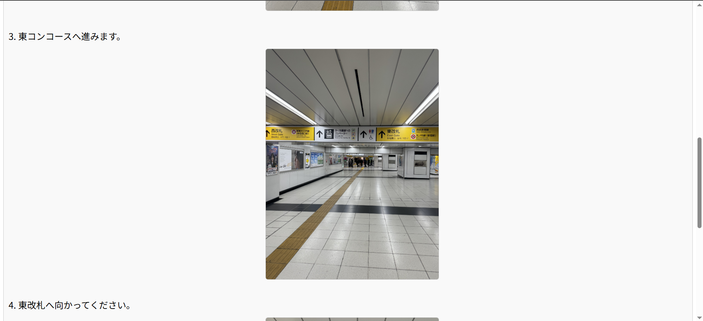
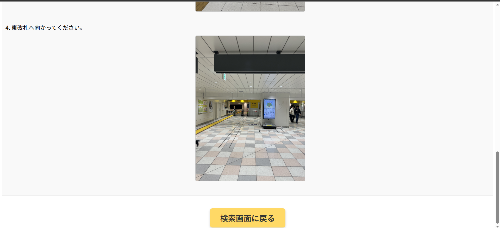
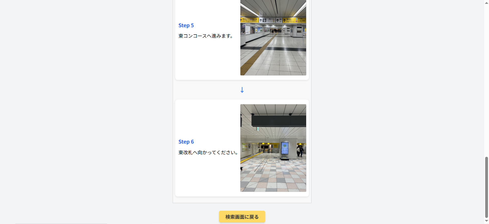

# 新宿駅構内ナビゲーションシステム

■ 概要

本アプリは、駅構内で迷った実体験をきっかけに開発した
写真付き経路案内Webアプリケーションです。

既存の地図型ナビでは分かりにくい「構内の階段・通路・コンコース」などを、
文章と実際の写真を用いて直感的に案内できる仕組みを実装しました。



---

■ 制作背景

自分自身が新宿駅構内で目的地に辿り着けなかった経験から、

地図だけでは方向感覚が掴みにくい

出口や階段の位置関係が分かりづらい

写真で案内してくれるサービスが少ない

という課題を感じ、本システムを開発しました。
---

## 使用技術
- Java  
- JSP / Servlet  
- JDBC  
- H2 Database  
- Apache Tomcat 10  
- HTML / CSS  

---

■ 主な機能

出発地点／到着地点の選択

最短経路の算出

ステップごとの案内表示（カード形式UI）

各ステップに対応した画像表示

階段ルート／エレベータルートの分岐設計

H2データベースによる経路データ管理

---

■ 工夫した点

① 写真とDBを紐づけた設計

STATION_EDGEテーブルに画像パスを持たせることで、
経路案内と視覚情報を一体化しました。

② 経路探索ロジックの実装

ノードとエッジによるグラフ構造を設計し、
最短経路探索を実装しています。

③ UI改善

案内をカード形式で表示することで、
スマートフォンでも見やすい設計を意識しました。

④ ルート分岐設計

階段ルートとエレベータルートを分岐可能な構造に設計し、
将来的なバリアフリー対応拡張を想定しています。

---

## 画面イメージ






---

## 🔮 今後の改善点
- スマートフォン表示への対応
- 多言語対応（英語表記）の実装
- エレベーター・階段を考慮した経路選択機能の追加

---

## 起動方法（ローカル環境）

1. このリポジトリをクローン
```bash
git clone https://github.com/IshiiReon/station-navigation-system.git
2. Eclipse などの IDE にインポート
3. Apache Tomcat 10 にプロジェクトを登録
4. サーバーを起動し、以下にアクセス  
   http://localhost:8080/station-navigation-system/
